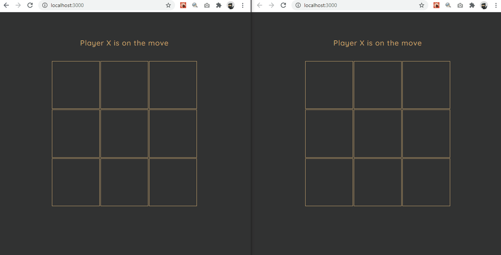

## Tic Tac Toe

Tic Tak Toe multiplayer game with SocketIO and React.



## Getting Started

- Install the dependencies

```
npm install
```

- Run the server

```
npm run watch
```

- Run the client

```
npm run start
```

- Open your browser and navigate to [http://localhost:3000/](http://localhost:3000/)

- Start Playing

Since I prefer learning by doing, this is a project that will help me get to know SocketIO and NodeJS better. This is an initial version that will need a lot of improvement.
